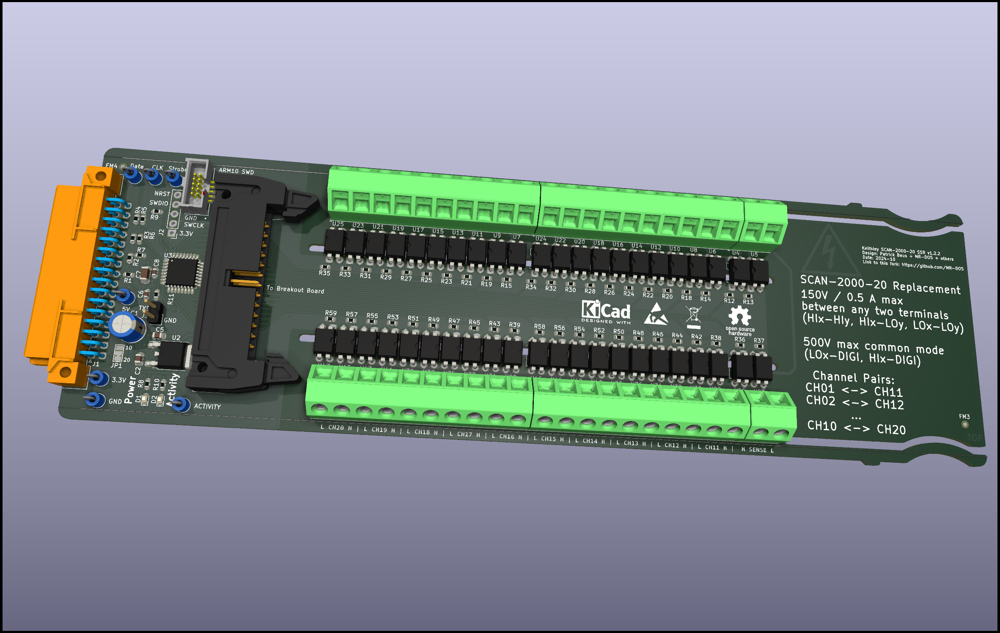

Keithley SCAN2000 SSR Replacement
===================

Notes from MR-DOS: This device is functionally the same as the original one made by hb020. However, since I work in medical eletronics field, I had the urge to check the barriers between the switched terminals and the microcontroller section against related design and safety standards. This PCB should be compliant with IPC-2221B, UL796 and UL60950-1, though take this device as low voltage device with only FUNCTIONAL barrier, NOT SAFETY barrier. Due to conflict with IPC-2221B on one of the barriers (between adjacent pins of the SSRs) and recommended rating of the SSRs, I have lowered rating of this card to a maximum of 150 V and 0.5 A of DC or peak voltage/current. Even though I have checked that the device should be safe under these conditions, I can not guarantee this. For example, in cases where soldering residues are left on the PCB, the rating may be compromised. Take into account that this scanning card is not suitable for measuring of low voltages or temperature (due to cheap terminals with high TC) or currents (due to leakage of the SSRs) or combinations of low and high voltages/currents, especially for AC (due to capacitance of the SSRs). For such needs, relay based cards are more suitable. Also, the card has been re-routed because... I didn't like the routing (which is a personal thing and it does not mean that hb020's version is bad in any way!).

This repository contains the KiCAD PCB project files for a Keithley SCAN2000 replacement card. It uses solid-state relays instead of mechanical relays.
Note from MR-DOS: You do not need to assemble the PFL connector, it is used for external switching matrix. I was too lazy to remove the connector in this image, see original repo for the image.

It has a header for a flat cable connector that can be used on a [breakout board](https://github.com/hb020/SCAN2000_breakout), allowing the relays and input terminals to be moved to an external box.
Note from MR-DOS: In such case, you do not need to assemble the terminals and SSRs. I was too lazy to provide this second image, see original repo for the image.

This breakout board is easier to move about than the typical huge and stiff multiconnector cable that goes into the standard board. And it already has connectors on it.

You can also use the flat cable connector for leds that indicate which input is active, but in that case you must stay below 4mA.

Apart from the above, the following changes were made to the original:

* Silk screen has been somewhat improved: added explanations of the screw terminal use.
* Programming/debugging via a standard ARM10 SWD connector is now possible. It has enough space around it for the use of a STDC14 connector. You can also still use the 2.54mm pin header.

|DMM|Tested|Works|Note|
|--|--|--|--|
|[DMM6500](https://www.tek.com/en/products/keithley/digital-multimeter/dmm6500)|:heavy_check_mark:|:heavy_check_mark:||
|2000|:x:|:heavy_check_mark:|Not tested, but should work. The latest firmware seems to [support 20 channels](https://www.eevblog.com/forum/circuit-studio/example-project-20-channel-solid-state-scan-card-for-k2000-dmm/msg3101128/#msg3101128).|
|2000-20|:x:|:heavy_check_mark:|Not tested, but should work.|
|[2010](https://www.tek.com/en/products/keithley/digital-multimeter/2010-series)|:x:|:x:|Not tested, but should be the same as the Model 2002.|
|[2001](https://www.tek.com/en/products/keithley/digital-multimeter/2001-series)|:x:|:x:|Not tested, but should be the same as the Model 2002.|
|[2002](https://www.tek.com/en/products/keithley/digital-multimeter/2002-series)|:heavy_check_mark:|:x:|The serial clock of 2 MHz is too fast for the MCU.|

About
-----
The root folder contains the KiCAD files. The bill of materials can be found in the [/bom](bom/) folder, while the gerber files can be found in the [/gerber](gerber/) folder.

Description
-------------------
The design is based on the SCAN2000 pcb made by [George Christidis](https://github.com/macgeorge/SCAN2000STM32). It also uses an STM32G0, but the pcb design is done in [KiCAD 7](https://www.kicad.org/) and corrects several problems like incorrect dimensions of the original design and replaces hard to obtain parts like the resistor arrays. The card was tested in a Keithley DMM6500 (successfully) and a Keithley Model 2002 (not successfully).

Flashing the MCU
-------------------
The source code and installation instructions can be found [here](https://github.com/hb020/SCAN2000_Firmware). You will need a ST-Link adapter to flash the MCU.
The source code published on the [original repo](https://github.com/PatrickBaus/SCAN2000_Firmware) has serious flaws (at the time of my publishing).

Related Repositories
--------------------

There is no need for external repositories, all non-default symbols, footprints and 3d models are included in this repository.

License
-------
This work is released under the Cern OHL v.1.2 - see www.ohwr.org/licenses/cern-ohl/v1.2 or the included [LICENSE](LICENSE) file for more information.
